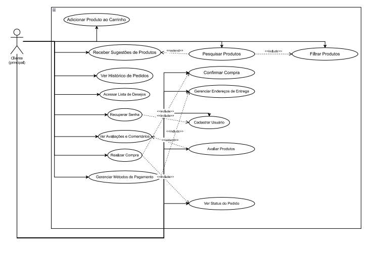

# Diagrama e Especificação de Casos de Uso

## Introdução
O modelo de casos de uso representa de forma estruturada as principais interações entre os usuários e o sistema, descrevendo os atores e as funcionalidades envolvidas. O sistema escolhido por nossa equipe foi o sistema de compra e venda **Shoppee** com o propósito de facilitar a compreensão dos requisitos funcionais e não funcionais. 

<strong>Autoria de <a href="https://github.com/edumoisessilva">Eduardo Moises</a></strong>

## Metodologia

O modelo de caso de uso foi escolhido para que seja de facil entendimento o fluxo de funcionamento do sistema, utilizando apenas um ator que representa o cliente principal e quais suas principais ações dentro do sistema.

## Diagramas de Caso de Uso

<strong>Figura 1</strong>

<strong>Autoria de <a href="https://github.com/edumoisessilva">Eduardo Moises</a></strong>

## Etapas do Processo

1. **Elicitação de Requisitos**  
   Identificação das necessidades dos usuários e definição dos requisitos funcionais e não funcionais.

2. **Análise e Priorização**  
   Classificação dos requisitos conforme impacto e importância para o sistema.

3. **Modelagem dos Casos de Uso**  
   Criação de tabelas e diagramas descrevendo as ações do usuário e as respostas do sistema.

4. **Validação e Revisão**  
   Análise do modelo para garantir coerência, completude e alinhamento aos objetivos do projeto.

> Essa metodologia garante clareza na comunicação entre desenvolvedores, analistas e stakeholders, facilitando a implementação do sistema.

<strong>Autoria de <a href="https://github.com/edumoisessilva">Eduardo Moises</a></strong>

---

<strong>Tabela 1: Caso de Uso UC01</strong>

| ID   | Caso de Uso                    | Descrição                                                           | Atores Envolvidos            |
| -----| ------------------------------ | ------------------------------------------------------------------- | ---------------------------- |
| UC01 | Cadastro de Usuário            | Permite que compradores  criem uma conta no sistema                 | Usuário                      |
| UC02 | Login e Recuperação de Senha   | Permite login e recuperação de senha via link no e-mail             | Usuário                      |
| UC03 | Pesquisa de Produtos           | Permite buscar produtos por nome, categoria ou filtros              | Usuário                      |
| UC04 | Visualizar Detalhes de Produto | Mostra informações completas e avaliações de um produto             | Usuário                      |
| UC05 | Gerenciar Carrinho             | Permite adicionar, remover e visualizar produtos no carrinho        | Usuário                      |
| UC06 | Finalizar Compra               | Permite concluir uma compra com métodos de pagamento e confirmação  | Usuário                      |
| UC07 | Acompanhar Pedido              | Permite visualizar o status e histórico dos pedidos                 | Usuário                      |
| UC08 | Avaliar Produto                | Permite inserir avaliações após compras concluídas                  | Usuário                      |
| UC09 | Recomendações Personalizadas   | Sugere produtos com base em buscas e compras anteriores             | Sistema                      |
| UC10 | Gerenciar Endereços            | Permite cadastrar e editar endereços de entrega                     | Usuário                      | 
| UC11 | Exibir Termos e Políticas      | Exibe os termos de uso e política de privacidade                    | Usuário                      |

| ID    | Descrição                                              | Requisitos Relacionados     | Impacto no Sistema                               | Prioridade     |
| ----- | ------------------------------------------------------ | --------------------------- | ------------------------------------------------ | -------------- |
| NFC01 | Suporte a múltiplos dispositivos (desktop e mobile)    | RNF04                       | Garante usabilidade em várias plataformas        | Alta           |
| NFC02 | Alta disponibilidade e desempenho com muitos usuários  | RNF03                       | Evita lentidão e falhas com acessos simultâneos  | Alta           |
| NFC03 | Conformidade com a LGPD e segurança de dados           | RNF05                       | Protege dados pessoais e sensíveis dos usuários  | Alta           |
| NFC04 | Acessibilidade para pessoas com deficiência visual     | RNF02                       | Garante inclusão e usabilidade universal         | Média          |
| NFC05 | Tempo de resposta e carregamento rápido                | RNF01, RNF06                | Melhora a experiência do usuário                 | Média          |
| NFC06 | Suporte a múltiplos idiomas                            | RNF07                       | Expande o alcance global do sistema              | Baixa          |
| **Data de criação**   | 08/10/2025  |

<strong>Autoria de <a href="https://github.com/edumoisessilva">Eduardo Moises</a></strong>

---

<strong>Tabela 2: Caso de Uso UC08</strong>

| Campo                 | Descrição                                                                                                                                                                                                                                                                                                                                                                          |
| --------------------- | ---------------------------------------------------------------------------------------------------------------------------------------------------------------------------------------------------------------------------------------------------------------------------------------------------------------------------------------------------------------------------------- |
| **UC08**              | Avaliar Produto                                                                                                                                                                                                                                                                                                                                                                    |
| **Descrição**         | Permite que o usuário insira avaliações e comentários sobre produtos adquiridos, atribuindo notas e feedbacks que ficam visíveis para outros compradores.                                                                                                                                                                                                                          |
| **Atores**            | - Usuário   - Sistema de e-commerce                                                                                                                                                                                                                                                                                                                                             |
| **Pré-condições**     | 1. O usuário está autenticado no sistema.   2. O usuário possui pelo menos uma compra concluída do produto que deseja avaliar.                                                                                                                                                                                                                                                  |
| **Ação**              | O usuário acessa a página de um produto já comprado e envia uma avaliação, incluindo nota (por exemplo, de 1 a 5 estrelas) e comentário. O sistema valida e registra a avaliação, atualizando a média geral do produto.                                                                                                                                                            |
| **Fluxo principal**   | - O usuário acessa o histórico de pedidos e seleciona um produto comprado.   - O usuário escolhe a opção “Avaliar Produto”.   - O sistema exibe o formulário de avaliação (nota e comentário).   - O usuário preenche e confirma o envio.   - O sistema valida os dados e grava a avaliação.   - O sistema atualiza e exibe a média geral de avaliações do produto. |
| **Fluxo alternativo** | - O usuário tenta avaliar um produto que ainda não comprou.   - O sistema exibe uma mensagem: “Você só pode avaliar produtos que já comprou.”    - O usuário envia o formulário incompleto (sem nota ou comentário).   - O sistema solicita o preenchimento dos campos obrigatórios antes de prosseguir.                                                               |
| **Fluxo de exceção**  | - Ocorre falha na comunicação com o servidor ao salvar a avaliação.   - O sistema exibe uma mensagem de erro: “Não foi possível registrar sua avaliação. Tente novamente mais tarde.”                                                                                                                                                                                           |
| **Pós-condições**     | A avaliação é armazenada no banco de dados e vinculada ao produto e ao usuário. A média de avaliações do produto é atualizada e exibida para os demais usuários.                                                                                                                                                                                                                   |                                                                                                                                                                                                                                                                     |
| **Data de criação**   | 17/10/2025                                                                                                                                                                                                                                                                                                                                                                         |

<strong>Autoria de <a href="https://github.com/edumoisessilva">Eduardo Moises</a></strong>

---

### **UC04 – Lembretes de Revisão de Conteúdos**

<strong>Tabela 3: Caso de Uso UC07</strong>

| Campo | Descrição |
|-------|-----------|
| UC07 | Acompanhar Pedido |
| Descrição | O sistema permite que o usuário visualize o status e o progresso de seus pedidos, recebendo atualizações automáticas sobre cada etapa da entrega. |
| Ator | Usuário, Sistema de notificações |
| Pré-condições | 1. O usuário possui pedidos registrados no sistema. 2. Está logado em sua conta. |
| Ação | O sistema exibe a linha do tempo de entrega e envia notificações automáticas conforme o status do pedido muda (ex.: “Pedido enviado”, “Em transporte”, “Entregue”). |
| Fluxo principal | - O usuário acessa a página “Meus Pedidos”. - O sistema busca os dados de entrega dos pedidos. - O sistema exibe o status atual (ex.: “Em transporte”). - O sistema envia notificações automáticas a cada atualização de status. |
| Fluxo alternativo | - O usuário cancela o pedido antes do envio. - O sistema atualiza o status para “Cancelado” e interrompe notificações. |
| Fluxo de exceção | - Falha na comunicação com o servidor de entrega. - O sistema exibe a mensagem: “Não foi possível atualizar o status do pedido neste momento.” |
| Pós-condições | O usuário é informado sobre o andamento de seu pedido e pode acompanhar todas as etapas da entrega. |
| Data de criação | 17/10/2025 |
          

<strong>Autoria de <a href="https://github.com/edumoisessilva">Eduardo Moises</a></strong>

---

### **UC05 – Configuração da Forma de Notificação**

<strong>Tabela 4: Caso de Uso UC10</strong>

| Campo                 | Descrição                                                                                                                                                                                                                                              |
| --------------------- | ------------------------------------------------------------------------------------------------------------------------------------------------------------------------------------------------------------------------------------------------------ |
| **UC10**              | Gerenciar Endereços                                                                                                                                                                                                                                    |
| **Descrição**         | O usuário acessa o perfil e gerencia os endereços de entrega, podendo cadastrar, editar ou remover endereços preferenciais para futuras compras.                                                                                                       |
| **Ator(es)**          | - Usuário   - Sistema de gerenciamento de endereços                                                                                                                                                                                                 |
| **Pré-condições**     | 1. O usuário está autenticado no sistema.  2. O sistema possui acesso ao banco de dados de endereços cadastrados.                                                                                                                                   |
| **Ação**              | O usuário adiciona, edita ou exclui endereços de entrega conforme sua necessidade. O sistema salva as alterações e atualiza o endereço padrão.                                                                                                         |
| **Fluxo principal**   | - O usuário acessa “Minha Conta” e seleciona “Endereços”.  - O sistema exibe os endereços cadastrados.  - O usuário escolhe adicionar, editar ou excluir um endereço.  - O sistema salva as alterações realizadas e define o endereço padrão. |
| **Fluxo alternativo** | - O usuário não informa todos os campos obrigatórios ao adicionar um novo endereço.  - O sistema solicita o preenchimento dos campos obrigatórios antes de salvar.                                                                                  |
| **Fluxo de exceção**  | - Ocorre falha na conexão com o banco de dados.  - O sistema exibe mensagem de erro: “Não foi possível salvar as alterações. Tente novamente mais tarde.”                                                                                           |
| **Pós-condições**     | Os endereços do usuário são atualizados, e o endereço padrão será utilizado em futuras compras e entregas.                                                                                                                                             |                                                                                                                                           |
| **Data de criação**   | 17/10/2025 

<strong>Autoria de <a href="https://github.com/edumoisessilva">Eduardo Moises</a></strong>

---

<strong>Tabela 5: Caso de Uso UC06</strong>

| Campo | Descrição |
|-------|------------|
| **UC06** | Notificação de Prazo de Entrega |
| **Descrição** | O sistema envia alertas automáticos ao aluno quando uma atividade está próxima do prazo final. |
| **Ator** | Aluno, Sistema de notificações |
| **Pré-condições** | 1. O aluno possui atividades cadastradas com prazo de entrega.  2. Está logado no sistema. |
| **Ação** | O sistema verifica prazos e envia alertas automáticos próximos da data limite. |
| **Fluxo principal** | - O sistema verifica atividades com prazo próximo. - Gera alerta de prazo. - Envia notificação ao aluno. |
| **Fluxo alternativo** | - O aluno já entregou a atividade. - O sistema não envia mais alertas. |
| **Fluxo de exceção** | - Falha no envio da notificação. - O prazo da atividade é alterado após o envio do alerta. |
| **Pós-condições** | O aluno recebe lembrete sobre a entrega das atividades no tempo adequado. |
| **Data de criação** | 08/10/2025 |

<strong>Autoria de <a href="https://github.com/edumoisessilva">Eduardo Moises</a></strong>

| Campo                 | Descrição                                                                                                                                                                                                                                                                                 |
| --------------------- | ----------------------------------------------------------------------------------------------------------------------------------------------------------------------------------------------------------------------------------------------------------------------------------------- |
| **UC09**              | Recomendações Personalizadas                                                                                                                                                                                                                                                              |
| **Descrição**         | O sistema analisa o histórico de buscas, visualizações e compras do usuário para sugerir produtos relevantes e personalizados, aumentando a chance de novas compras.                                                                                                                      |
| **Ator**              | - Usuário   - Sistema de recomendação inteligente                                                                                                                                                                                                                                      |
| **Pré-condições**     | 1. O usuário possui histórico de navegação ou compras no sistema.  2. O sistema tem acesso autorizado aos dados de comportamento e preferências do usuário.                                                                                                                            |
| **Ação**              | O sistema coleta e analisa dados de comportamento do usuário, identifica padrões de interesse e exibe recomendações de produtos relacionadas.                                                                                                                                             |
| **Fluxo principal**   | - O usuário acessa a página inicial ou um produto específico.  - O sistema coleta dados de navegação e histórico de compras.  - O sistema aplica algoritmos de recomendação para identificar preferências.  - O sistema exibe sugestões personalizadas de produtos relacionados. |
| **Fluxo alternativo** | - O usuário é novo e ainda não possui histórico de navegação.  - O sistema exibe produtos populares ou promoções gerais até coletar dados suficientes.                                                                                                                                 |
| **Fluxo de exceção**  | - Falha na análise de dados ou indisponibilidade do módulo de recomendação.  - O sistema exibe mensagem padrão: “Não foi possível gerar recomendações no momento.”                                                                                                                     |
| **Pós-condições**     | O usuário visualiza recomendações personalizadas com base em seu perfil e comportamento, melhorando a experiência de compra.                                                                                                                                                              |
)                                                                                                                                                                              |
| **Data de criação**   | 17/10/2025

<strong>Autoria de <a href="https://github.com/edumoisessilva">Eduardo Moises</a></strong>

---

| Campo                 | Descrição                                                                                                                                                                                                                                                                                                           |
| --------------------- | ------------------------------------------------------------------------------------------------------------------------------------------------------------------------------------------------------------------------------------------------------------------------------------------------------------------- |
| **UC06**              | Finalizar Compra                                                                                                                                                                                                                                                                                                    |
| **Descrição**         | O sistema processa o pedido do usuário, verificando o carrinho, endereço de entrega e método de pagamento, concluindo a compra com a geração da confirmação e do comprovante.                                                                                                                                       |
| **Ator**              | - Usuário   - Sistema de Pagamento   - Sistema de Processamento de Pedidos                                                                                                                                                                                                                                    |
| **Pré-condições**     | 1. O usuário possui produtos válidos no carrinho.  2. O sistema de pagamento e o banco de dados de pedidos estão operando normalmente.                                                                                                                                                                           |
| **Ação**              | O sistema valida as informações do pedido, processa o pagamento e confirma a compra, gerando o número do pedido e a nota fiscal.                                                                                                                                                                                    |
| **Fluxo principal**   | - O usuário acessa o carrinho e seleciona “Finalizar Compra”.  - O sistema solicita o endereço e método de pagamento.  - O usuário confirma as informações.  - O sistema processa o pagamento e registra o pedido.  - O sistema exibe mensagem de sucesso com o número do pedido e previsão de entrega. |
| **Fluxo alternativo** | - O pagamento é recusado.  - O sistema exibe mensagem: “Pagamento não aprovado. Tente outro método.”   - O usuário cancela a operação antes da confirmação.  - O sistema mantém o carrinho sem alterações.                                                                                              |
| **Fluxo de exceção**  | - Falha na comunicação com o gateway de pagamento.  - O sistema exibe mensagem: “Erro ao processar a compra. Tente novamente mais tarde.”                                                                                                                                                                        |
| **Pós-condições**     | O pedido é registrado com sucesso, e o usuário recebe confirmação da compra e do pagamento.                                                                                                                                                                                                                         |                                                                                                                                                                                                        |
| **Data de criação**   | 17/10/2025                                                                                                                                                                                                                                                                                                          |

<strong>Autoria de <a href="https://github.com/edumoisessilva">Eduardo Moises</a></strong>

---

| Campo                 | Descrição                                                                                                                                                                                                                                              |
| --------------------- | ------------------------------------------------------------------------------------------------------------------------------------------------------------------------------------------------------------------------------------------------------ |
| **UC05**              | Gerenciar Carrinho                                                                                                                                                                                                                                     |
| **Descrição**         | O sistema monitora as ações do usuário em relação aos produtos adicionados, removidos ou alterados no carrinho, atualizando automaticamente os valores e quantidades e gerando um resumo final antes da compra.                                        |
| **Ator**              | - Usuário   - Sistema de Gerenciamento de Carrinho                                                                                                                                                                                                  |
| **Pré-condições**     | 1. O usuário possui sessão ativa no sistema.  2. Existem produtos disponíveis no catálogo.                                                                                                                                                          |
| **Ação**              | O sistema registra as ações do usuário (adicionar, remover ou atualizar produtos) e gera um resumo atualizado do carrinho, com valores e quantidades totais.                                                                                           |
| **Fluxo principal**   | - O usuário acessa o carrinho de compras.  - Adiciona, remove ou altera a quantidade de produtos.  - O sistema atualiza automaticamente o subtotal e o valor total.  - O sistema exibe um resumo do carrinho com todos os produtos e valores. |
| **Fluxo alternativo** | - O usuário tenta adicionar um produto fora de estoque.  - O sistema exibe mensagem: “Produto indisponível.”   - O usuário remove todos os produtos do carrinho.  - O sistema exibe mensagem: “Seu carrinho está vazio.”                   |
| **Fluxo de exceção**  | - Falha na atualização do carrinho.  - O sistema exibe mensagem: “Não foi possível atualizar o carrinho. Tente novamente mais tarde.”                                                                                                               |
| **Pós-condições**     | O sistema mantém o carrinho atualizado conforme as ações do usuário, garantindo a integridade das informações para a finalização da compra.                                                                                                            |                                                                                                                                          |
| **Data de criação**   | 17/10/2025                                                                                                                                                                                                                                             |
                                     

<strong>Autoria de <a href="https://github.com/edumoisessilva">Eduardo Moises</a></strong>

---

| Campo                 | Descrição                                                                                                                                                                                                                                                                                                                    |
| --------------------- | ---------------------------------------------------------------------------------------------------------------------------------------------------------------------------------------------------------------------------------------------------------------------------------------------------------------------------- |
| **UC03**              | Pesquisa de Produtos                                                                                                                                                                                                                                                                                                         |
| **Descrição**         | Permite que o usuário realize buscas por produtos utilizando nome, categoria ou filtros específicos, exibindo resultados relevantes e organizados de acordo com os critérios selecionados.                                                                                                                                   |
| **Ator**              | - Usuário                                                                                                                                                                                                                                                                                                                    |
| **Pré-condições**     | 1. O usuário deve estar autenticado ou em sessão ativa.  2. O sistema deve possuir produtos cadastrados no banco de dados.                                                                                                                                                                                                |
| **Ação**              | O sistema processa a consulta do usuário, filtra os produtos correspondentes e exibe os resultados de acordo com os parâmetros informados.                                                                                                                                                                                   |
| **Fluxo principal**   | 1. O usuário acessa a barra de pesquisa ou a página de categorias.  2. O usuário insere o termo de busca ou seleciona filtros (ex.: preço, categoria, marca).  3. O sistema busca no banco de dados os produtos correspondentes.  4. O sistema exibe os resultados da pesquisa com imagem, nome, preço e avaliação. |
| **Fluxo alternativo** | Nenhum produto encontrado: se a busca não retornar resultados, o sistema exibe a mensagem “Nenhum produto encontrado para sua pesquisa.”    Falta de conexão temporária: o sistema exibe “Não foi possível carregar os resultados. Verifique sua conexão e tente novamente.”                                           |
| **Fluxo de exceção**  | Falha crítica de pesquisa: erro ao acessar o banco de dados ou ao processar os filtros. O sistema exibe a mensagem “Ocorreu um erro ao realizar a pesquisa. Tente novamente mais tarde.” e registra o erro em log.                                                                                                           |
| **Pós-condições**     | O sistema exibe os produtos encontrados conforme os critérios de busca informados pelo usuário.                                                                                                                                                                                                                              |                                                                                                    
| **Data de criação**   | 17/10/2025|

<strong>Autoria de <a href="https://github.com/edumoisessilva">Eduardo Moises</a></strong>

---

| Campo                 | Descrição                                                                                                                                                                                                                                                                                                                                   |
| --------------------- | ------------------------------------------------------------------------------------------------------------------------------------------------------------------------------------------------------------------------------------------------------------------------------------------------------------------------------------------- |
| **UC12**              | Notificar alunos sobre atividades próximas do prazo de entrega                                                                                                                                                                                                                                                                              |
| **Descrição**         | O sistema envia notificações automáticas aos alunos informando sobre atividades com prazo de entrega próximo, ajudando no gerenciamento do tempo e na organização das tarefas.                                                                                                                                                              |
| **Ator**              | - Sistema de Notificações   - Aluno                                                                                                                                                                                                                                                                                                      |
| **Pré-condições**     | 1. O aluno deve estar matriculado na disciplina e possuir atividades registradas com prazos definidos. 2. O sistema de notificações deve estar configurado e ativo. 3. O aluno deve ter autorizado o recebimento de notificações.                                                                                                     |
| **Ação**              | O sistema verifica periodicamente as atividades com prazos próximos e envia notificações de alerta aos alunos.                                                                                                                                                                                                                              |
| **Fluxo principal**   | 1. O sistema verifica a base de dados em busca de atividades com prazos próximos (ex: 24h antes da entrega). 2. O sistema identifica os alunos inscritos nessas atividades. 3. O sistema envia notificações automáticas (push, e-mail ou dentro da plataforma). 4. O aluno recebe a notificação e visualiza o alerta na interface. |
| **Fluxo alternativo** | - O aluno desativou notificações: o sistema ignora o envio para esse usuário. - O aluno já entregou a atividade: o sistema não envia o alerta.                                                                                                                                                                                           |
| **Fluxo de exceção**  | - Falha no envio de notificações por erro no servidor de mensagens. O sistema registra o erro no log e tenta reenviar em 30 minutos. - Falha de rede impede o recebimento do alerta. O sistema armazena a notificação e reenviará quando a conexão for restabelecida.                                                                    |
| **Pós-condições**     | O aluno é informado sobre atividades com prazos próximos, reduzindo o risco de atrasos.                                                                                                                                                                                                                                                     |                                                                                                                                                                                                                                                                                                                                       
| **Data de criação**   | 09/10/2025

<strong>Autoria de <a href="https://github.com/edumoisessilva">Eduardo Moises</a></strong>

---

### **UC12 – Organização do Banco de Questões por Conteúdo**
**Requisito Associado:** RF32 – O banco de questões deve estar separado por conteúdo.

<strong>Tabela 6: Caso de Uso UC03</strong>

| Campo                 | Descrição                                                                                                                                                                                                                                                                                         |
| --------------------- | ------------------------------------------------------------------------------------------------------------------------------------------------------------------------------------------------------------------------------------------------------------------------------------------------- |
| **UC03**              | Pesquisa e Filtragem de Produtos                                                                                                                                                                                                                                                                  |
| **Descrição**         | Permite ao usuário buscar produtos e aplicar filtros por categoria, preço, marca ou outros atributos, exibindo apenas os itens correspondentes aos critérios selecionados.                                                                                                                        |
| **Ator**              | - Usuário  - Sistema de Catálogo de Produtos                                                                                                                                                                                                                                                   |
| **Pré-condições**     | 1. O usuário deve estar autenticado ou ter acesso à plataforma. 2. Existem produtos cadastrados no sistema com categorias e atributos definidos. 3. O sistema de catálogo está funcionando corretamente.                                                                                    |
| **Ação**              | O usuário seleciona filtros de pesquisa, e o sistema exibe apenas os produtos que atendem aos critérios escolhidos.                                                                                                                                                                               |
| **Fluxo principal**   | - O usuário acessa a página de pesquisa ou catálogo. - O sistema exibe opções de filtro (categoria, preço, marca, avaliação, etc.). - O usuário seleciona os filtros desejados. - O sistema atualiza a visualização, exibindo apenas os produtos que correspondem aos filtros aplicados. |
| **Fluxo alternativo** | - Nenhum produto corresponde aos filtros aplicados. - O sistema exibe a mensagem: “Nenhum produto encontrado para os critérios selecionados.”                                                                                                                                                  |
| **Fluxo de exceção**  | - Falha na conexão com o banco de dados ou no processamento de filtros. - O sistema exibe mensagem: “Não foi possível carregar os produtos. Tente novamente mais tarde.”                                                                                                                       |
| **Pós-condições**     | O usuário visualiza uma lista de produtos filtrada conforme os critérios selecionados, facilitando a escolha e compra.                                                                                                                                                                            |
                                                                        |
| **Data de criação**   | 17/10/2025                                                                                                                                                                                                                                                                                        |

<strong>Autoria de <a href="https://github.com/edumoisessilva">Eduardo Moises</a></strong>

---

### **UC13 – Acesso ao Painel de Desempenho Centralizado**
**Requisito Associado:** RF34 – A integração deve reduzir o esforço de professores e monitores, centralizando informações sobre atividades e desempenho.

<strong>Tabela 7: Caso de Uso UC07</strong>

| Campo                 | Descrição                                                                                                                                                                                                                                                                                                   |
| --------------------- | ----------------------------------------------------------------------------------------------------------------------------------------------------------------------------------------------------------------------------------------------------------------------------------------------------------- |
| **UC07**              | Acompanhar Pedido                                                                                                                                                                                                                                                                                           |
| **Descrição**         | Permite que o usuário visualize em um painel centralizado todas as informações sobre seus pedidos, incluindo status, histórico de alterações, prazos de entrega e notificações de envio.                                                                                                                    |
| **Ator**              | - Usuário  - Sistema de Pedidos  - Sistema de Notificações                                                                                                                                                                                                                                            |
| **Pré-condições**     | 1. O usuário possui pedidos registrados no sistema. 2. O sistema de pedidos e de envio de notificações estão funcionando corretamente. 3. O usuário está autenticado na plataforma.                                                                                                                   |
| **Ação**              | O sistema coleta dados de diferentes módulos (status do pedido, rastreio da entrega, histórico de alterações) e exibe tudo em um painel unificado para o usuário.                                                                                                                                           |
| **Fluxo principal**   | - O usuário acessa a seção “Meus Pedidos” ou um pedido específico. - O sistema busca dados de status, histórico de alterações e rastreio da entrega. - A interface exibe um painel centralizado mostrando todas as informações do pedido (ex.: status atual, etapas anteriores, previsão de entrega). |
| **Fluxo alternativo** | - Um pedido ainda não possui informações completas de rastreio. - O sistema exibe as informações disponíveis e uma mensagem: “Rastreamento não disponível no momento”.                                                                                                                                   |
| **Fluxo de exceção**  | - Falha na integração com algum módulo de pedidos ou rastreio. - O sistema exibe os dados que conseguiu carregar e a mensagem: “Algumas informações do pedido não puderam ser carregadas”.                                                                                                               |
| **Pós-condições**     | O usuário visualiza todas as informações de seus pedidos de forma centralizada, facilitando o acompanhamento e reduzindo consultas dispersas.                                                                                                                                                               |
                                                                                 
| **Data de criação**   | 17/10/2025

<strong>Autoria de <a href="https://github.com/edumoisessilva">Eduardo Moises</a></strong>

---

<strong>Tabela 8: Caso de Uso UC09</strong>

| Campo                 | Descrição                                                                                                                                                                                                                                                                                                                                                        |
| --------------------- | ---------------------------------------------------------------------------------------------------------------------------------------------------------------------------------------------------------------------------------------------------------------------------------------------------------------------------------------------------------------- |
| **UC09**              | Recomendações Personalizadas                                                                                                                                                                                                                                                                                                                                     |
| **Descrição**         | O sistema analisa o comportamento de navegação e histórico de compras do usuário, sugerindo produtos relevantes de forma proativa para aumentar a probabilidade de novas compras.                                                                                                                                                                                |
| **Ator**              | - Usuário  - Sistema de Recomendação Inteligente                                                                                                                                                                                                                                                                                                              |
| **Pré-condições**     | 1. O usuário está logado na plataforma. 2. Existem produtos cadastrados com histórico de vendas e atributos suficientes para análise. 3. O sistema de recomendação está ativo e integrado ao catálogo de produtos.                                                                                                                                         |
| **Ação**              | O sistema identifica produtos relacionados ao interesse atual do usuário e apresenta recomendações em destaque na interface.                                                                                                                                                                                                                                     |
| **Fluxo principal**   | - O usuário acessa a página inicial ou uma página de produto. - O sistema analisa comportamento de navegação e histórico de compras. - O sistema exibe sugestões de produtos relacionados com mensagens como “Produtos que você pode gostar”. - O usuário clica na sugestão. - O sistema redireciona o usuário para a página do produto recomendado. |
| **Fluxo alternativo** | - O usuário ignora ou fecha as sugestões. - O sistema continua exibindo recomendações de forma dinâmica sem interromper a navegação.                                                                                                                                                                                                                          |
| **Fluxo de exceção**  | - Nenhum produto relevante é encontrado para o perfil do usuário. - O sistema exibe produtos populares ou em promoção como alternativa. - Falha na geração das recomendações: o sistema registra o erro e mantém a interface padrão.                                                                                                                       |
| **Pós-condições**     | O usuário visualiza produtos sugeridos de forma personalizada, aumentando o engajamento e a probabilidade de compra.                                                                                                                                                                                                                                             |
                                                                                                                                                                                                                                                    
| **Data de criação**   | 17/10/2025

<strong>Autoria de <a href="https://github.com/edumoisessilva">Eduardo Moises</a></strong>

---

## Validação dos casos de uso

## Referências
Lucid Software Português. Tutorial de Caso de Uso UML. Youtube, 25 abr. 2019. Disponível em: [https://youtu.be/ab6eDdwS3rA?si=geKJuyxRkgBXmeJE](https://youtu.be/ab6eDdwS3rA?si=geKJuyxRkgBXmeJE). Acesso em: 10 outubro 2025.

