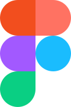
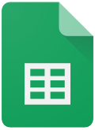

# Ferramentas

## Introdução 
Este documento descreve as ferramentas adotadas no desenvolvimento deste trabalho, abrangendo aquelas já implementadas, em uso atual ou previstas para uso futuro. Cada ferramenta desempenha um papel crucial na execução e apresentação das tarefas realizadas pela equipe.

## Ferramentas Utilizadas
Tabela 1: ferramentas utilizadas 

  
    
<b>Tabela 1:</b> Ferramentas Utilizadas

  

<table>
  <thead>
    <tr>
      <th style="text-align: center;">Logo</th>
      <th style="text-align: center;">Descrição</th>
    </tr>
  </thead>
  <tbody>
    <tr>
      <td style="text-align: center;">
        
      </td>
      <td><strong><a href="https://www.canva.com/">Canva</a></strong>: Criação da Rich Picture.</td>
    </tr>
    <tr>
      <td style="text-align: center;">
        
      </td>
      <td><strong><a href="https://gemini.google.com/">Gemini</a></strong>: Apoio na geração de conteúdos dos artefatos, markdown e correção textual.</td>
    </tr>
    <tr>
      <td style="text-align: center;">
        
      </td>
      <td><strong><a href="https://www.figma.com/">Figma</a></strong>: Criação de protótipos e design.</td>
    </tr>
    <tr>
      <td style="text-align: center;">
        
      </td>
      <td><strong><a href="https://github.com/">Github</a></strong>: Controle de versão e colaboração no código.</td>
    </tr>
    <tr>
      <td style="text-align: center;">
        
      </td>
      <td><strong><a href="https://www.google.com/docs/about/">Google Docs</a></strong>: Produção e edição colaborativa de textos.</td>
    </tr>
    <tr>
      <td style="text-align: center;">
        
      </td>
      <td><strong><a href="https://www.google.com/sheets/about/">Google Planilhas</a></strong>: Organização de planilhas e cronogramas e criação do heatmap.</td>
    </tr>
    <tr>
      <td style="text-align: center;">
        
      </td>
      <td><strong><a href="https://www.lucidchart.com/">Lucidchart</a></strong>: Criação de diagramas e fluxogramas.</td>
    </tr>
    <tr>
      <td style="text-align: center;">
        
      </td>
      <td><strong><a href="https://www.mkdocs.org/">MkDocs</a></strong>: Criação e organização da documentação do projeto.</td>
    </tr>
    <tr>
      <td style="text-align: center;">
        
      </td>
      <td><strong><a href="https://discord.com/">Discord</a></strong>: Reuniões online.</td>
    </tr>
    <tr>
      <td style="text-align: center;">
        
      </td>
      <td><strong><a href="https://code.visualstudio.com/">Visual Studio Code</a></strong>: Edição da documentação.</td>
    </tr>
    <tr>
      <td style="text-align: center;">
        
      </td>
      <td><strong><a href="https://www.whatsapp.com/">WhatsApp</a></strong>: Canal de comunicação geral da equipe.</td>
    </tr>
  </tbody>
</table>

<strong>Autoria de: <a href="https://github.com/JoaoPC10">João Igor</a></strong>

## Referências  

[1] CANVA. Disponível em: [https://www.canva.com/](https://www.canva.com/). Acesso em: 09 de abril de 2025.  

[2] FIGMA. Disponível em: [https://www.figma.com/](https://www.figma.com/). Acesso em: 09 de abril de 2025.  

[3] GEMINI. Disponível em: [https://gemini.google.com/](https://gemini.google.com/). Acesso em: 09 de abril de 2025.  

[4] GITHUB. Disponível em: [https://github.com/](https://github.com/). Acesso em: 09 de abril de 2025.   

[5] GOOGLE DOCS. Disponível em: [https://www.google.com/docs/about/](https://www.google.com/docs/about/). Acesso em: 09 de abril de 2025.  

[6] GOOGLE PLANILHAS. Disponível em: [https://www.google.com/sheets/about/](https://www.google.com/sheets/about/). Acesso em: 12 de outubro de 2025. 

[7] LUCIDCHART. Disponível em: [https://www.lucidchart.com/](https://www.lucidchart.com/). Acesso em: 12 de outubro de 2025.

[8] MKDOCS. Disponível em: [https://www.mkdocs.org/](https://www.mkdocs.org/). Acesso em: 12 de outubro de 2025.

[9] VISUAL STUDIO CODE. Disponível em: [https://code.visualstudio.com/](https://code.visualstudio.com/). Acesso em: 12 de outubro de 2025.  

[10] WHATSAPP. Disponível em: [https://www.whatsapp.com/](https://www.whatsapp.com/). Acesso em: 12 de outubro de 2025.

[11] DISCORD. Disponível em: [https://www.discord.com/](https://www.discord.com/). Acesso em: 12 de outubro de 2025.  

## Histórico de Versões

| Versão | Data | Descrição | Autor(es) | Revisor |
| ---- | ----- | ----- | ---- | ----- | 
| 1.0 | 12/10/2025 | Criação da página de documentação | [João Igor](https://github.com/JoaoPC10) | [Luisa](https://github.com/luisa12ll) |
