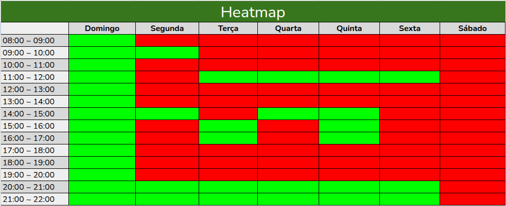

# HeatMap

## Introdução
Um heatmap (ou mapa de calor) é uma técnica de visualização de dados que utiliza cores para representar a magnitude de um fenômeno em duas dimensões. É um recurso gráfico poderoso que permite a visualização rápida da densidade, intensidade ou frequência de dados em uma matriz.

A lógica fundamental do heatmap é simples: os valores de dados são traduzidos em um gradiente de cores. Geralmente, as cores quentes (como vermelho, laranja e amarelo) representam os valores mais altos, mais frequentes ou de maior intensidade, enquanto as cores frias (como azul, verde ou tons neutros) representam os valores mais baixos, menos frequentes ou de menor intensidade.

## Heat Map da equipe
**Figura 1: Heat Map da equipe**

<strong>Autoria de: <a href="https://github.com/JoaoPC10">João Igor</a></strong>

Analisando o Heat Map, podemos ver que:

- Durante a semana, temos segunda a sexta à noite (20h-22h) como um bom horário  
- Durante o fim de semana, temos o domingo durante o dia todo como um ótimo horário

## Histórico de versão

| Versão | Data | Descrição | Autor(es) | Revisor |
| ---- | ----- | ----- | ---- | ----- | 
| 1.0 | 12/10/2025 | Criação da página de documentação | [João Igor](https://github.com/JoaoPC10) | [Gabriel](https://github.com/Dev-Gabriel-Lima) |
