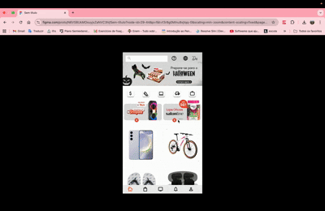

## Introdução

A prototipação visa validar a experiência do usuário em uma página da Shopee com duas funcionalidades chave: suporte a múltiplos idiomas e um Assistente Virtual (chatbot) integrado de autoatendimento.
O protótipo foi desenvolvido em alta fidelidade utilizando a ferramenta Figma, simulando a possível aparência final da página de e-commerce. O foco principal é a validação da usabilidade, ou seja, se o usuário consegue usar as novas funcionalidades com fácil entendimento.

## Imagens do Protótipo

## Protótipo: Suporte a Múltiplos Idiomas e Acessível a Pessoas com Deficiência Visual
**Autores:**  [João Igor](https://github.com/JoaoPC10), [Luisa](https://github.com/luisa12ll) e [Anna Clara](https://github.com/AnnaClarafg) 
**Rastreabilidade:**   [RNF02](https://joaopc10.github.io/Desafio1-TraineeEngNet-2025-Shopee/Elicitacao/requisitos_elicitados/#RNF02), [RNF07](https://joaopc10.github.io/Desafio1-TraineeEngNet-2025-Shopee/Elicitacao/requisitos_elicitados/#RNF07) 
**Ferramenta:**  Figma 
**Tipo:**   Alta Fidelidade  
**Link para o protótipo na íntegra:** [Projeto Shopee](https://www.figma.com/proto/N6VS8UkMOsuyjxZaNVC3hl/Sem-t%C3%ADtulo?node-id=29-44&p=f&t=f3r8g0Mlnu9xjtqq-0&scaling=min-zoom&content-scaling=fixed&page-id=0%3A1&starting-point-node-id=29%3A44)

    

| Versão | Data   | Descrição  | Autor(es) |Revisor   |
|--------|--------|------------|-----------|----------|
| 1.0 | 18/10/2025 | Criação do documento e do protótipo | [João Igor](https://github.com/JoaoPC10) | [Luisa](https://github.com/luisa12ll)|