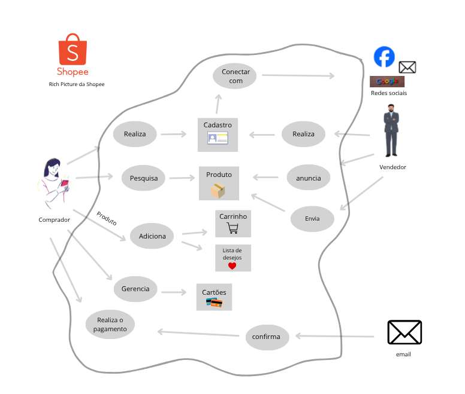
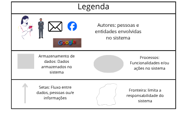

# Rich Picture

## Introdução
O Rich Picture é uma técnica visual e colaborativa fundamental na engenharia de requisitos, projetada para simplificar a comunicação e a exploração de sistemas complexos de forma intuitiva. Ele serve como um recurso essencial para representar os principais componentes do sistema, incluindo usuários, processos, fluxos de informação, armazenamento de dados, limites do sistema e quaisquer problemas potenciais. Devido à sua natureza informal, o Rich Picture favorece a obtenção de uma visão sistêmica abrangente, ao mesmo tempo que estimula o diálogo entre todos os participantes do projeto, auxiliando crucialmente na identificação de requisitos e na detecção de pontos críticos.

**Figura 1: Rich Picture da Shopee**

### Legenda

Para melhor entendimento da imagem, abaixo está uma figura de referência contendo as características e significados de cada elemnto em um Rich Picture.

<strong>Autoria de: <a href="https://github.com/JoaoPC10">João Igor</a>, <a href="https://github.com/AnnaClarafg">Anna Clara</a></strong>

## Referências
SOFTWARE Development Project: Introducing Rich Pictures. [S.l.: s.n.], [s.d.]. 8 p. Material didático da disciplina CTEC2402. Disponível em: [Software Development Project](../arquivos/IntroducingRichPictures.pdf). Acesso em: 14 out. 2025.

## Histórico de versão

| Versão | Data | Descrição | Autor(es) | Revisor(es) |
| ---- | ----- | ----- | ---- | ----- | 
| 1.0 | 12/10/2025 | Preenchimento das infos iniciais e criação do rich picture | [João Igor](https://github.com/JoaoPC10), [Anna Clara](https://github.com/AnnaClarafg) | [Gabriel](https://github.com/Dev-Gabriel-Lima), [Luisa de Souza](https://github.com/luisa12ll) |Software Development Project
