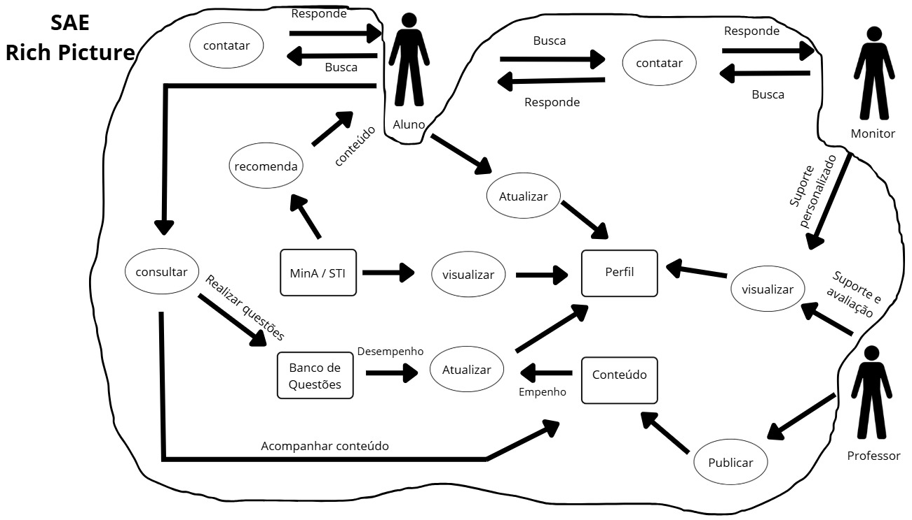

# Rich Picture

## Introdução
O Rich Picture é uma técnica visual colaborativa utilizada para explorar e comunicar a complexidade de sistemas de maneira simples e intuitiva. Na engenharia de requisitos, ele funciona como um recurso importante para representar os principais elementos de um sistema, como usuários, processos, fluxos de informação, armazenamento de dados, limites e possíveis problemas. Por ser uma representação informal, favorece uma visão sistêmica, estimula o diálogo entre os participantes do projeto e auxilia na identificação de requisitos e pontos críticos.

Nesse projeto, o Rich Picture foi desenvolvido com base no sistema SAE, escolhido pelo grupo pela afinidade com o uso e por ser um sistema presente na vida acadêmica de muitos estudantes da FCTE. Aqui utilizamos o Rich Picture para representar os atores, as funcionalidades, principais ações e os limites do sistema.

A elaboração do nosso Rich Picture foi feita através da ferramenta Canva. Logo abaixo, temos o Rich Picture do SAE (Figura 1), sua legenda (Figura 2) e a legenda dos principais tópicos do SAE (Figura 3).

**Figura 1: Rich Picture do SAE**

<strong>Autores: <a href="https://github.com/TiagoTeixeira-2005">Tiago Lemes</a> e <a href="https://github.com/ArthurGuilher62">Arthur Guilherme</a></strong>

## Histórico de versão

| Versão | Data | Descrição | Autor(es) | Revisor |
| ---- | ----- | ----- | ---- | ----- | 
| 1.0 | 12/10/2025 | Preenchimento das infos iniciais e criação do rich picture | [João Igor](https://github.com/JoaoPC10) | [Gabriel](https://github.com/Dev-Gabriel-Lima) |